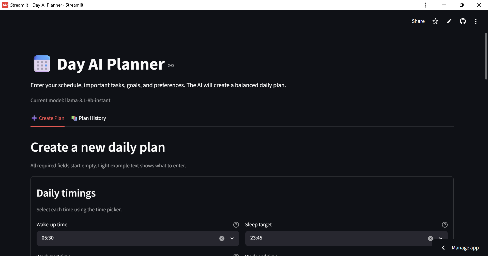
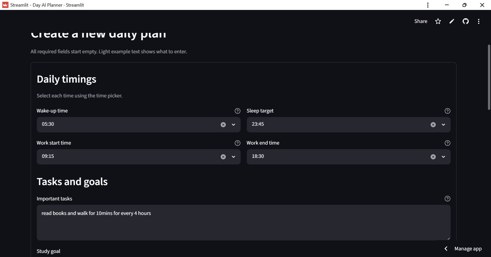
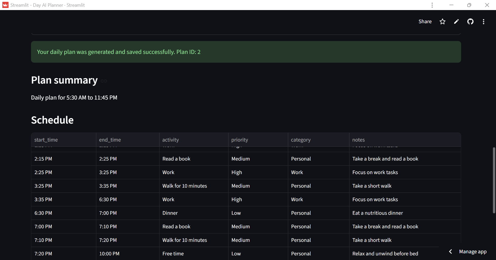
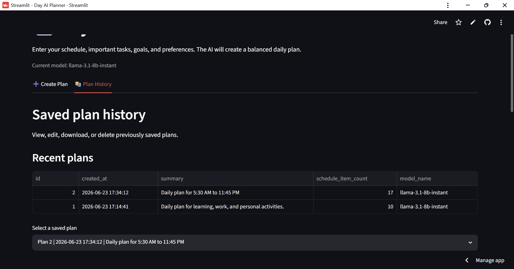
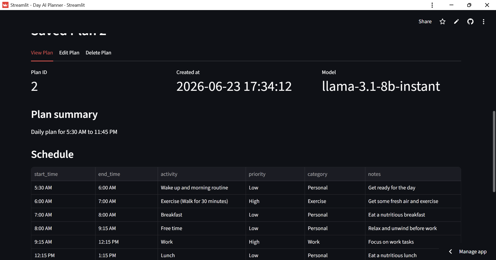
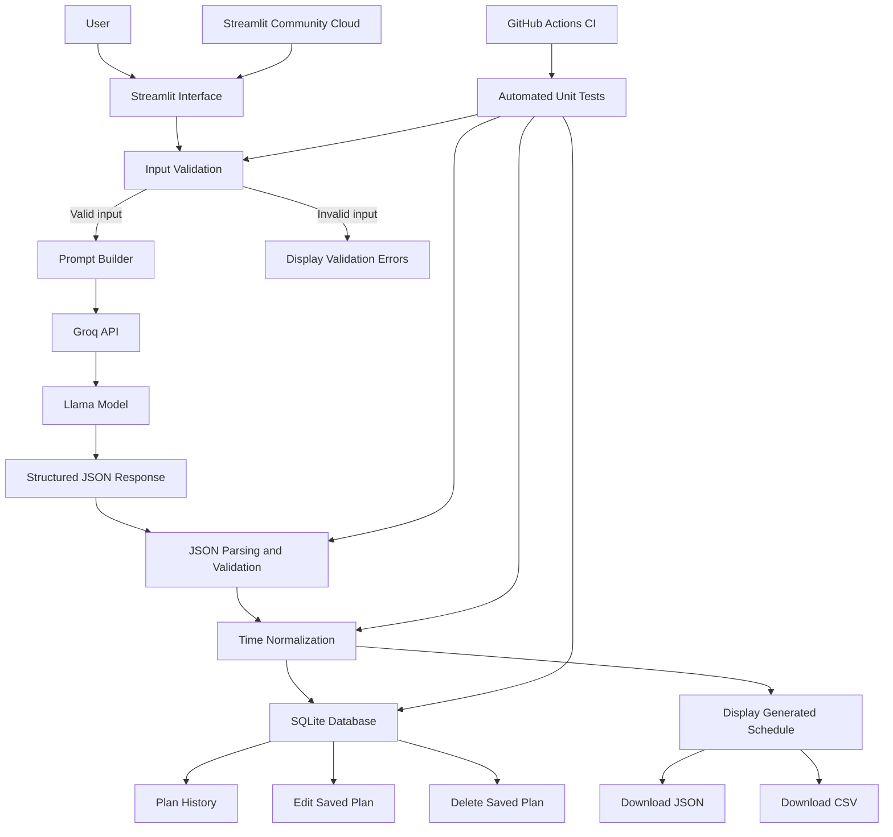

# Day AI Planner

Day AI Planner is an AI-powered productivity application that creates a personalized daily schedule based on the user's timings, tasks, goals, energy level, and preferences.

The application uses Streamlit for the user interface, Groq for LLM access, structured JSON for predictable responses, and SQLite for local plan storage.

## Features

* Generate a complete daily schedule using AI
* Collect wake-up, work, study, exercise, and sleep information
* Consider the user's highest-energy period
* Produce structured JSON output
* Validate the AI-generated response
* Automatically retry failed JSON generation
* Normalize flexible time formats
* Prevent invalid and overlapping schedule entries
* Save plans in a local SQLite database
* View previously generated plans
* Edit saved plans
* Delete saved plans
* Download plans as JSON
* Download schedules as CSV for Excel
* Run automated time and database tests

## Time Normalization

The application accepts several time formats and converts them into a consistent `h:mm AM/PM` format.

Examples:

| User input | Normalized result |
| ---------- | ----------------- |
| `10.15`    | `10:15 AM`        |
| `10;15 am` | `10:15 AM`        |
| `1015`     | `10:15 AM`        |
| `8.30 pm`  | `8:30 PM`         |
| `14.30`    | `2:30 PM`         |
| `7`        | `7:00 AM`         |

Invalid values such as `25.80` are rejected.

The application also checks that schedule rows remain chronological and do not overlap.

## Application Flow

```text
User enters daily information
        ↓
Streamlit validates the form
        ↓
User prompt is created
        ↓
Request is sent to Groq
        ↓
LLM generates structured JSON
        ↓
JSON is parsed and validated
        ↓
Times are normalized
        ↓
Plan is saved in SQLite
        ↓
Schedule is displayed
        ↓
User can edit, delete, or download the plan
```

## Project Architecture

```text
Day_AI_Planner/
│
├── app.py
├── requirements.txt
├── README.md
├── .env.example
├── .gitignore
│
├── prompts/
│   ├── __init__.py
│   └── planner_prompts.py
│
├── services/
│   ├── __init__.py
│   └── planner_service.py
│
├── database/
│   ├── __init__.py
│   └── database_service.py
│
├── utils/
│   ├── __init__.py
│   ├── exporters.py
│   ├── time_utils.py
│   └── validators.py
│
├── tests/
│   ├── __init__.py
│   ├── test_database_service.py
│   └── test_time_utils.py
│
└── data/
    └── .gitkeep
```

## Module Responsibilities

### `app.py`

Handles the Streamlit user interface.

Responsibilities include:

* Displaying the user-input form
* Processing submitted values
* Displaying generated plans
* Displaying plan history
* Editing saved plans
* Deleting saved plans
* Providing download buttons

### `prompts/planner_prompts.py`

Contains the system prompt that controls the AI planner.

It defines:

* Planner behavior
* Scheduling rules
* Required JSON structure
* Required schedule fields
* Allowed priority values

### `services/planner_service.py`

Handles communication with the Groq API.

Responsibilities include:

* Reading the API configuration
* Creating the Groq client
* Sending prompts to the LLM
* Retrying failed JSON generation
* Parsing the JSON response
* Normalizing schedule times
* Validating the final plan

### `database/database_service.py`

Handles all SQLite database operations.

Functions include:

* Initializing the database
* Saving a new plan
* Retrieving plan history
* Retrieving a plan by ID
* Updating a saved plan
* Deleting a saved plan

### `utils/time_utils.py`

Handles flexible time parsing and normalization.

It also validates:

* Hours
* Minutes
* AM and PM values
* Chronological order
* Overlapping activities

### `utils/validators.py`

Validates:

* User form values
* AI-generated JSON structure
* Required schedule fields
* Priority values

### `utils/exporters.py`

Converts generated plans into:

* JSON
* CSV

### `tests/`

Contains automated tests for:

* Time normalization
* Invalid time rejection
* Schedule overlap detection
* Database initialization
* Plan saving
* Plan retrieval
* Plan history
* Plan updating
* Plan deletion

## Technologies Used

* Python
* Streamlit
* Groq API
* Llama model
* SQLite
* JSON
* CSV
* Python `unittest`
* Python virtual environments
* `python-dotenv`

## Requirements

Before running the application, install:

* Python
* Git
* A Groq API key

## Local Setup

### 1. Clone the repository

```powershell
git clone <your-repository-url>
cd Day_AI_Planner
```

Replace `<your-repository-url>` with the actual GitHub repository URL.

### 2. Create a virtual environment

```powershell
python -m venv venv
```

### 3. Activate the virtual environment

Windows PowerShell:

```powershell
.\venv\Scripts\Activate.ps1
```

The terminal should display:

```text
(venv)
```

### 4. Install project dependencies

```powershell
python -m pip install -r requirements.txt
```

### 5. Create the `.env` file

Copy the example environment file:

```powershell
Copy-Item .env.example .env
```

Open `.env` and replace the placeholder API key with your real Groq API key.

```env
GROQ_API_KEY=your_real_groq_api_key
GROQ_MODEL=llama-3.1-8b-instant
```

Never upload the real `.env` file or API key to GitHub.

The model value can be replaced with another supported Groq model when required.

## Run the Application

From the main project folder, run:

```powershell
python -m streamlit run app.py
```

The terminal should display a local address similar to:

```text
Local URL: http://localhost:8501
```

Open that address in a browser.

## Run Automated Tests

Run all tests:

```powershell
python -m unittest discover -s tests -v
```

The current project contains:

```text
17 time utility tests
11 database tests
28 total tests
```

Expected result:

```text
Ran 28 tests

OK
```

## Database

The application uses a local SQLite database:

```text
data/day_planner.db
```

The database is created automatically when the application saves its first plan.

The database file is excluded from GitHub because it may contain personal schedule information.

Database automated tests use temporary SQLite files and do not modify the real application database.

## Environment Variables

| Variable       | Purpose                                    |
| -------------- | ------------------------------------------ |
| `GROQ_API_KEY` | Authenticates requests to Groq             |
| `GROQ_MODEL`   | Selects the model used for plan generation |

## Security

The following files must never be uploaded publicly:

```text
.env
data/day_planner.db
.streamlit/secrets.toml
```

The `.gitignore` file prevents these files from being committed.

Never place an API key directly inside Python code.

## Error Handling

The application handles:

* Missing API keys
* Groq API failures
* Invalid JSON
* Empty model responses
* Invalid schedule structure
* Invalid time formats
* Overlapping activities
* Invalid database IDs
* Database storage failures
* Empty required fields

## Future Improvements

Possible future enhancements include:

* User authentication
* Cloud database storage
* Google Calendar integration
* Calendar-style schedule display
* PDF and Excel export
* Recurring plans
* Plan templates
* Mobile-friendly interface
* Email reminders
* Multiple user profiles
* Cloud deployment
* CI/CD automated testing

## Author

Manikanta P
## Live Application

[Open the deployed Day AI Planner](https://YOUR-STREAMLIT-APP-URL.streamlit.app)

The application is deployed on Streamlit Community Cloud and connected to the GitHub repository.

## Application Screenshots


### Application Overview

The Day AI Planner provides two main sections: **Create Plan** and **Plan History**. Users can generate personalized schedules and manage previously saved plans.




### Create a Daily Plan

Users enter their wake-up time, sleep target, work hours, important tasks, goals, energy period, and additional preferences.



### AI-Generated Daily Schedule

The application sends the user's information to the Groq-hosted Llama model and receives a structured daily schedule containing times, activities, priorities, categories, and notes.



### Saved Plan History

Generated schedules are stored in SQLite. The Plan History section displays the plan ID, creation time, summary, schedule-item count, and model used.



### View and Manage Saved Plans

Users can view a complete saved schedule, edit schedule details, normalize time values, download the plan, or permanently delete it.



## Application Architecture



### Architecture Flow

1. The user enters daily timings, tasks, goals, and preferences through the Streamlit interface.
2. The application validates all required form values before contacting the AI service.
3. A structured prompt is created and sent to the Groq API.
4. The Llama model generates the daily plan as structured JSON.
5. The response is parsed, validated, and normalized into consistent time formats.
6. The completed plan is displayed and saved in SQLite.
7. Users can view, edit, download, or delete saved plans.
8. Automated tests validate time-processing and database operations.
9. GitHub Actions runs all tests automatically after repository updates.
10. Streamlit Community Cloud hosts the deployed application.

